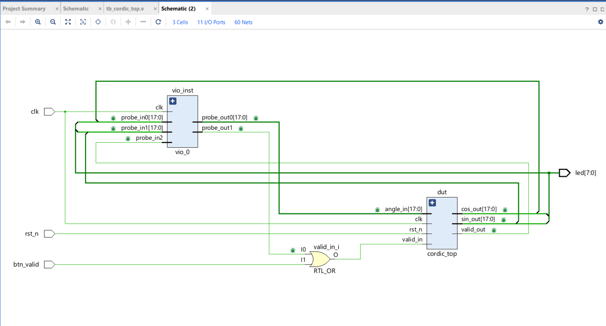

# FPGA Implementation of a Fast and Area-Efficient CORDIC Processor for Real-Time Trigonometric Computation

**Author:** Sai Surya Subhakshay Vemparala
**ID:** 2023AAPS0231H
**Batch:** P1
**Board:** Digilent ZedBoard (Xilinx Zynq-7000, xc7z020clg484-1)

---

## 1. Overview

This project implements a **CORDIC (COordinate Rotation DIgital Computer)** processor on an FPGA that computes `cos(θ)` and `sin(θ)` simultaneously for any input angle `θ ∈ [−π/2, +π/2]`, using **only shift and add operations** — no multipliers, no DSP blocks. The design was fully verified in simulation and demonstrated live on a ZedBoard using Xilinx's VIO (Virtual Input/Output) IP.

### Why CORDIC?

Conventional trigonometric computation on hardware relies on either:
- **Floating-point multipliers** — high area, high power, needs DSP blocks, or
- **Lookup tables** — high memory usage, limited resolution.

CORDIC avoids both by decomposing an arbitrary rotation into a sequence of elementary micro-rotations whose angles are pre-computed powers of two — so each step reduces to a binary shift and an add/subtract. This maps directly onto FPGA LUT-based logic and consumes **zero DSP48 blocks**, freeing them for other compute-intensive tasks.

**Key motivations:**
- **Hardware efficiency** — no multipliers required
- **Real-time performance** — pipelined CORDIC at 100 MHz achieves 170 ns latency, suitable for SDR and motor-vector control
- **Precision** — 16-stage iteration gives an absolute error of ~2⁻¹⁵ ≈ 3×10⁻⁵
- **Resource savings** — zero DSP48 usage

---

## 2. Mathematical Foundation

A 2-D vector rotation by angle θ is:

```
[x']   [cos θ  −sin θ] [x]
[y'] = [sin θ   cos θ] [y]
```

CORDIC replaces this matrix multiply with an iterative series. At stage `i`:

```
X(i+1) = X(i) − d(i) · Y(i) · 2^(−i)
Y(i+1) = Y(i) + d(i) · X(i) · 2^(−i)
Z(i+1) = Z(i) − d(i) · arctan(2^(−i))
```

where `d(i) = +1` if `Z(i) ≥ 0`, else `d(i) = −1`.

After `N` iterations, `Z(N) → 0`, yielding:

```
X(N) = K·cos(θ),   Y(N) = K·sin(θ)
```

The accumulated **CORDIC gain** `K = ∏ √(1 + 2^(−2i)) ≈ 1.6468` is pre-compensated by initializing `X0 = 1/K ≈ 0.6073`, eliminating the need for a post-multiplier and saving two DSP48 blocks.

---

## 3. System Architecture

> 📌 **Insert the overall block diagram screenshot here** (Vivado schematic showing `vio_inst`, `cordic_top`/`dut`, and the `RTL_OR` gate combining VIO valid and button valid — see `Schematic (2)` in the Vivado project).
>
> ```markdown
> 
> ```

### 3.1 Pre-rotation Stage
Extends the natural CORDIC convergence range of `[−π/2, +π/2]`. The initial `X` value is set to `1/K = 0.6073` (stored as `19898` in Q1.15 format) to pre-compensate the accumulating gain.

### 3.2 CORDIC Pipeline Core (16 Stages)
Fully unrolled using Verilog `generate`/`genvar` — all 16 stages instantiated simultaneously, giving a throughput of **1 result/cycle** once the pipeline fills. Each stage implements:
- **Arithmetic right shift (`>>>`)** for the `2^(−i)` scaling
- **Adder/subtractor** controlled by the sign of `Z`
- **Register (FF)** to pipeline the result to the next stage

### 3.3 Valid Signal Tracking
A 17-bit shift register propagates `valid_in` through the pipeline, asserting `valid_out` exactly **17 clock cycles** after each `valid_in` pulse (170 ns @ 100 MHz).

### 3.4 VIO-Based Hardware Debug
A Xilinx VIO IP core is integrated into `cordic_wrapper` for real-time hardware verification without needing physical switches/displays:

| Probe | Direction | Width | Connected to |
|---|---|---|---|
| `probe_out0` | Output (stimulate) | 18-bit | `angle_in` |
| `probe_out1` | Output (stimulate) | 1-bit | `vio_valid` |
| `probe_in0` | Input (monitor) | 18-bit | `cos_out` |
| `probe_in1` | Input (monitor) | 18-bit | `sin_out` |
| `probe_in2` | Input (monitor) | 1-bit | `valid_out` |

### 3.5 LED Visual Output
Top 4 bits of `cos_out` drive `LED[7:4]`, top 4 bits of `sin_out` drive `LED[3:0]`:

```verilog
assign led[7:4] = cos_out[17:14]; // top 4 bits of cosine
assign led[3:0] = sin_out[17:14]; // top 4 bits of sine
```

---

## 4. Pin Configuration

| Signal | Description | FPGA Pin | I/O Standard |
|---|---|---|---|
| `clk` | 100 MHz on-board oscillator | Y9 | — |
| `rst_n` | Reset (active low), SW0 | F22 | LVCMOS33 |
| `btn_valid` | Manual valid trigger, BTNC | P16 | LVCMOS33 |
| `led[0]` | LD0 | T22 | LVCMOS33 |
| `led[1]` | LD1 | T21 | LVCMOS33 |
| `led[2]` | LD2 | U22 | LVCMOS33 |
| `led[3]` | LD3 | U21 | LVCMOS33 |
| `led[4]` | LD4 | V22 | LVCMOS33 |
| `led[5]` | LD5 | W22 | LVCMOS33 |
| `led[6]` | LD6 | U19 | LVCMOS33 |
| `led[7]` | LD7 | U14 | LVCMOS33 |

**Number format:** 18-bit Q1.15 fixed point across all modules.

---

## 5. Design Flow

```
RTL Coding (Verilog) → Behavioral Simulation → Synthesis (Vivado)
        → Implementation (P&R) → Bitstream Generation
        → ZedBoard Programming → VIO Verification
```

---

## 6. Results

### 6.1 Hardware Verification (via VIO on ZedBoard)

Four test angles were injected via `probe_out0`, `valid` pulsed, and outputs read back after the 17-cycle pipeline latency:

| Angle | angle_in | cos_out | sin_out | Status |
|---|---|---|---|---|
| 0° | 0x00000 | 1.0000 | 0.0000 | PASS |
| 45° | 0x02000 | 0.7070 | 0.7071 | PASS |
| 90° | 0x04000 | ≈0 | 1.0000 | PASS |
| −45° | 0x3E000 | 0.7072 | −0.7070 | PASS |

**Hardware Pass Rate: 4/4 (100%)**

>  **Insert the output/waveform graph here** (e.g. the Vivado simulation waveform showing the 17-cycle pipeline latency, or a plotted cos/sin output curve).
>
> ```markdown
> 
> ```

### 6.2 Performance Summary

| Metric | Value |
|---|---|
| Clock frequency | 100 MHz |
| Pipeline latency | 17 cycles (170 ns) |
| Throughput | 1 result/cycle |
| DSP48 blocks used | 0 |
| Dynamic power | 2 mW |
| Max timing slack (WNS) | +27.118 ns (~137 MHz max) |

---

## 7. Comparison with Alternative Approaches

| Architecture | Latency | Throughput | LUTs | DSPs |
|---|---|---|---|---|
| **This work (16-stage pipelined CORDIC)** | 17 cyc | 1/cyc | 3% | 0 |
| Iterative CORDIC (no pipeline) | 16 cyc | 1/16 cyc | <1% | 0 |
| LUT-based (256-entry) | 1 cyc | 1/cyc | <1% | 0 |
| Taylor-series (3rd order) | 5 cyc | 1/cyc | ~5% | 4 |
| Floating-point IP core | 28 cyc | 1/cyc | ~10% | 3 |

---

## 8. Key Learnings

1. CORDIC is entirely multiplier-free — pure shift-and-add logic maps directly to FPGA fabric.
2. Pipelining trades latency for throughput — 17-cycle latency is recovered by sustained 1-result/cycle output.
3. Fixed-point design demands careful, consistent scaling (Q1.15, angle encoding with `π = 32768`) across all modules.
4. VIO enables rapid, flexible hardware verification without extra board-level I/O.
